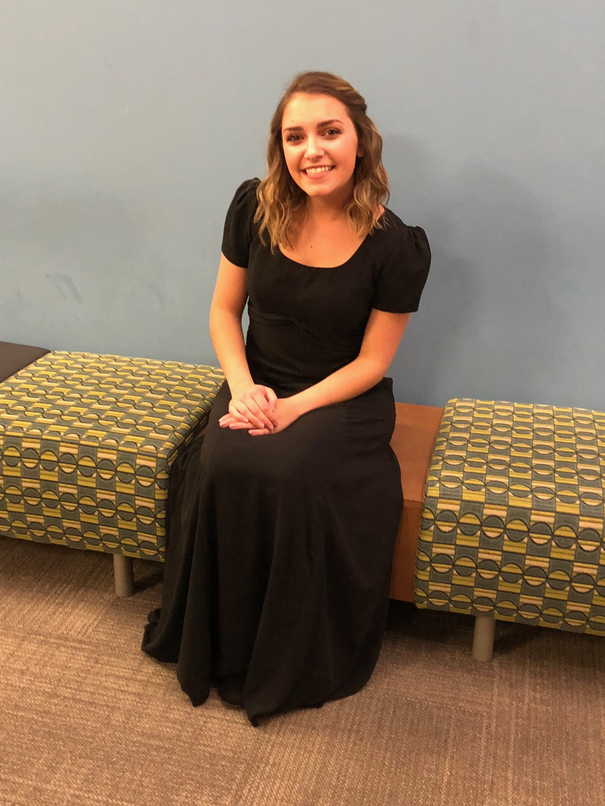

## Meg Brilleslyper: *Mezzo-Soprano*

<!-- Want a banner image? Find the image you want and store it in the images directory with the name `banner.jpg`. (Or you can modify the file name in the next line, with any image URL you want. -->

<!--  -->
 

<!-- If you don't want a banner, delete the previous line.  -->

## Information

- I am a senior at Discovery Canyon Campus High School in Colorado Springs
- I plan to major in vocal performance in college beginning Fall 2019.
- Here is my [resume](https://mmembrill.github.io/Meg-Brilleslyper/Meg_resume.pdf).

## Recent Competitions and Performances

- Colorado Wyoming NATS:  *1st place classical division*
- Colorado Wyoming NATS: *1st place music theater division*
- CMA Showcase concert
- MTNA National Finals Orlando Fl
- Soprano soloist for Michael Hadyn's Requiem performed by Soli Deo Gloria (90-voice community chorus)

### Links to some video performances

* [Voi Che Sapate](https://drive.google.com/open?id=1ZzvS-rvYw2467lPsFcj58P6Bk88naWhL) CO-WY NATS final performance
* [I'm just a Girl Who Can't Say No](https://drive.google.com/open?id=1CxY4c_Ba3t040YS77IbV6liHIHcLqzgW) CO-WY NATS

